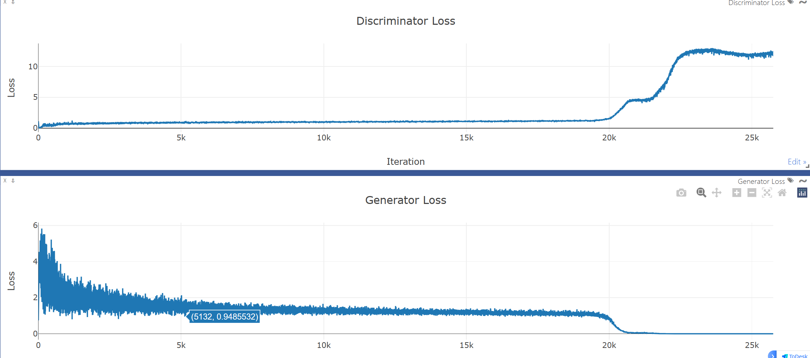
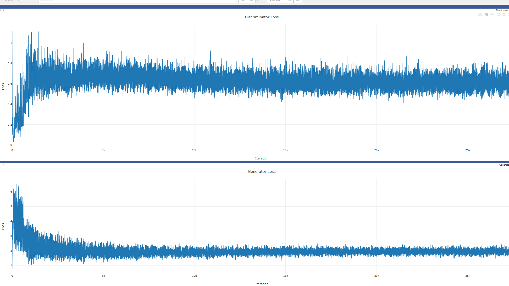

# 这是一个GAN网络的优化和Hyperband超参数搜索

Author：xsfsss

### 说在前头

此项目继承于我的上一任图像生成项目进行改进，git网址：

[xsfsss/A-lightweight-GAN-network-for-anime-avatar-generation: None (github.com)](https://github.com/xsfsss/A-lightweight-GAN-network-for-anime-avatar-generation)

## 总览

<small>Overview</small>

这是一个简单的GAN动漫头像生成网络，其中我们对cnn部分的网路进行了优化：

- 在Discriminator加入了残差模块
- 调整了卷积核大小
- 添加 Dropout 层，可以根据需要调整丢弃概率
- Generator和Discriminator都增加了一个block

原版网络在cnn_gan中可以找到


### 128x128 的 CnnGAN:

<small>128x128 CnnGAN</small>

### **优化调整后：**



前期Discriminator的波动明显减小，Generator的loss相应变大是正常的

虽然还是有梯度爆炸的情况，但是明显后移了（13k左右后移至20k）


### Hyperband运行结果：


可以通过Hyperband_Cnn_gan得到如上配置结果

当然，此方代码并不完善，如下报错并不影响我们得到程序的最优解，因此我没有后续优化代码。


### 优化参数后：



在25k次的生活并没有出现梯度爆炸的情况，并且loss趋于收敛

#### 最后结果：


梯度爆炸消失！！

### 缺点

在代码设计中，本项目以discriminator的loss作为优化指标（原生hyperband只能二维最优）因此可能会出现Generator无法学习的情况，例如Generator的loss一直很高，使得Discriminator的loss值很低，这个需要进一步炼丹。

<small>本作者认为，discriminator和generator的loss参数是独立开来的，即为代码中d1和d2可以分开通过hyperband找到，不过由于设备原因，暂不进行深入研究</small>

### 一些后话

Hyperband的NicknameServer弃用了，直接用NameServer即可（上面最后的报错可能跟这个有关）

在worker中我将源文件的logging输出由DEBUG级别改为了ERROR，否则后台一直会有输出

设备建议：16G以上显卡

## To start

### 环境配置

<small>Environment configuration</small>

- python >= 3.6
- torch >= 1.10 + 对应 cuda
- visdom

### 开启 visdom

<small>Start visdom</small>

```
python
python visdom.server -m
```

